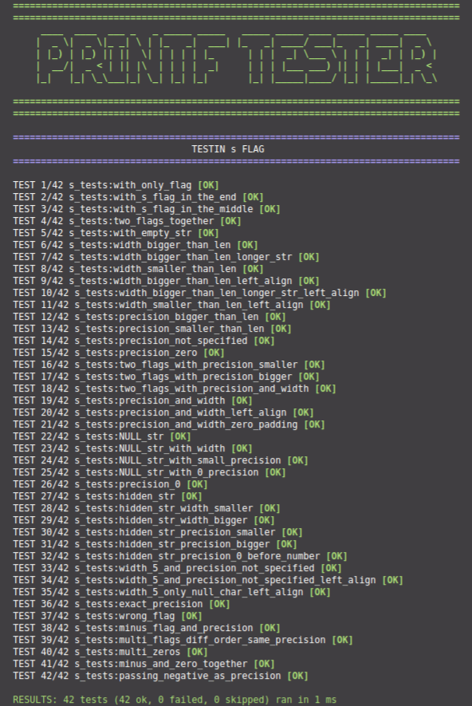
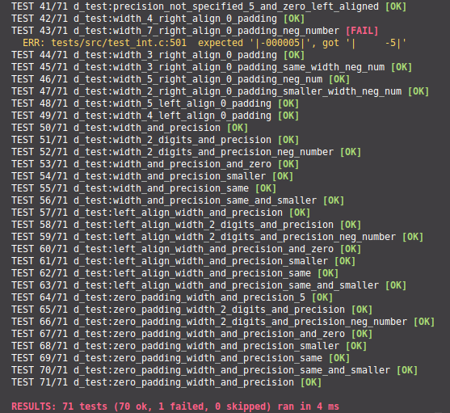

# 42PrintfTester

  
## You run tests separately, s example:

## When something goes wrong you can see what was the expected output.

## SETUP

1. Clone the repository in the same repo as your project:

        dir_root
            |_ printf
            |_ printf_tester

        Note if you project dir is not called printf, you'll need to change some the field PROJECT_NAME in the Makefile

2. Run:
   
        bash run_test.sh

# FT_PRINTF - MANDATORY PART

 - The prototype of ft_printf should be int ft_printf(const char *, ...);
 
 - You have to recode the libc’s printf function
 - It must not do the buffer management like the real printf
 - It will manage the following conversions: cspdiuxX%
 -  It will manage any combination of the following flags: ’-0.*’ and minimum field width with all conversions
 -  It will be compared with the real printf
 -  You must use the command ar to create your librairy, using the command libtool is forbidden.

# Thirdy-part library

-  [CTEST](https://github.com/bvdberg/ctest)

